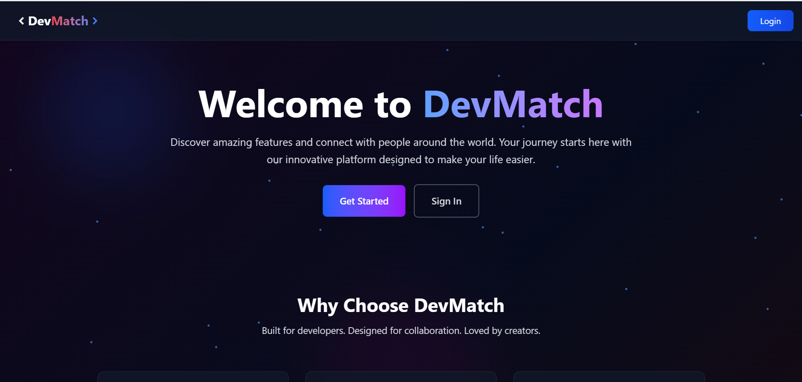
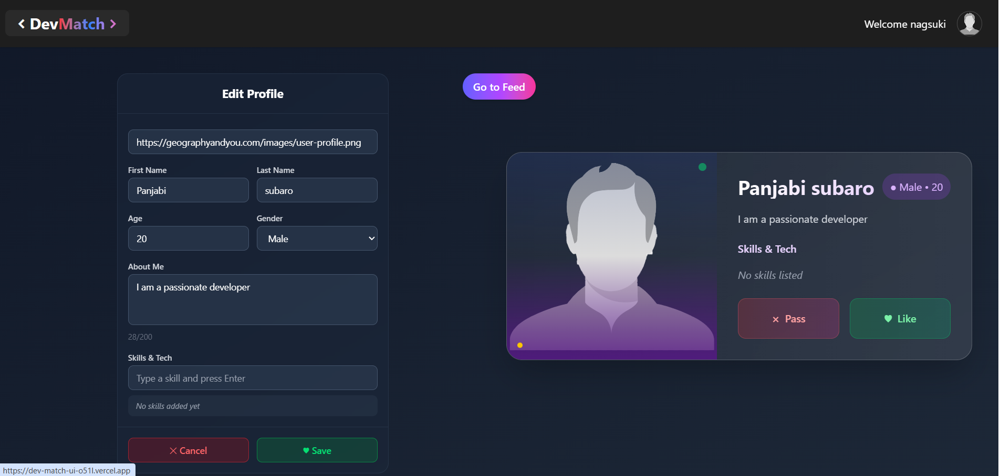
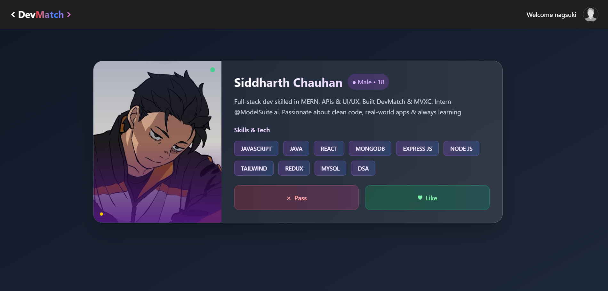
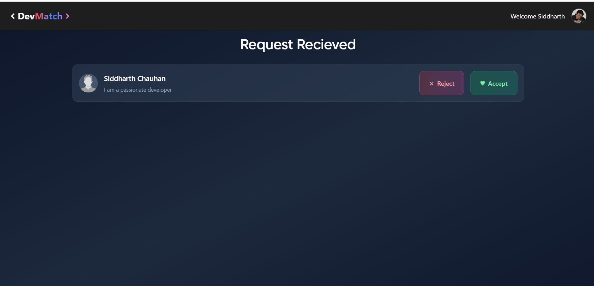
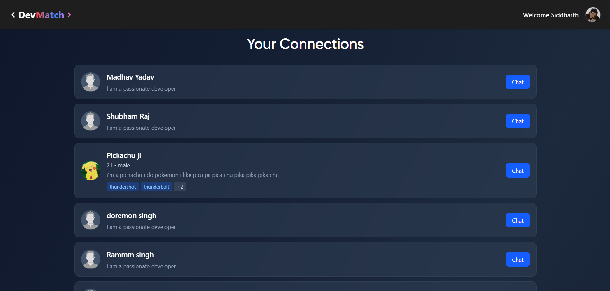
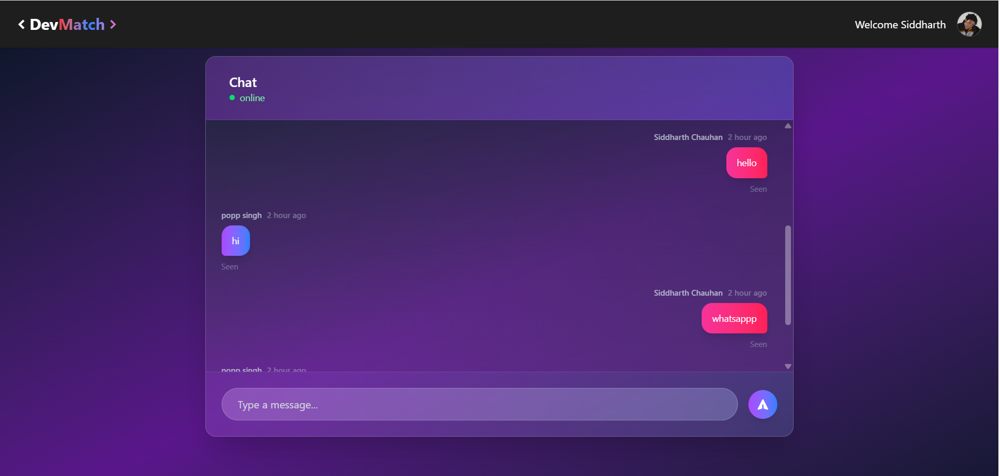

# 💻 DevMatch - Developer Matchmaking Platform

[](https://dev-match-ui-o51l.vercel.app)
[](https://reactjs.org/)
[](https://redux-toolkit.js.org/)
[](https://tailwindcss.com/)

DevMatch is a modern developer matchmaking platform that connects coders, collaborators, and creators from around the world. Built with cutting-edge technologies, it offers seamless real-time communication and an intuitive matching system designed specifically for the developer community.

## ✨ Key Features

- **🔐 Secure Authentication** - Complete user registration and login system
- **👤 Rich Profile Management** - Showcase your skills, projects, and experience
- **🎯 Smart Matchmaking** - AI-powered suggestions based on skills and interests
- **💬 Real-time Chat** - Instant messaging with WebSocket support
- **📱 Responsive Design** - Optimized for all devices and screen sizes
- **🌙 Modern UI/UX** - Clean, intuitive interface with Tailwind CSS
- **⚡ Fast Performance** - Built with Vite for lightning-fast development

## 🚀 Tech Stack

| Technology | Purpose | Version |
|------------|---------|---------|
| ⚛️ **React.js** | Frontend framework | 18+ |
| 🧠 **Redux Toolkit** | State management | Latest |
| 💬 **Socket.io** | Real-time communication | Latest |
| 💨 **Tailwind CSS** | Styling framework | Latest |
| 🌐 **Axios** | HTTP client | Latest |
| 🧭 **React Router** | Client-side routing | Latest |
| ⚡ **Vite** | Build tool & dev server | Latest |

## 🌐 Live Demo

Experience DevMatch in action: **[https://dev-match-ui-o51l.vercel.app](https://dev-match-ui-o51l.vercel.app)**

## 📸 Application Screenshots

<details>
<summary>View Screenshots</summary>

### 🏠 Landing Page


### 👤 Profile Setup


### 📰 Developer Feed


### 📨 Connection Requests


### 🔗 Your Connections


### 💬 Real-time Chat


</details>

## 🛠️ Quick Start

### Prerequisites
- Node.js (v16 or higher)
- npm or yarn package manager

### Installation

```bash
# Clone the repository
git clone https://github.com/Csiddharth7906/DevMatch-UI.git

# Navigate to project directory
cd DevMatch-UI

# Install dependencies
npm install

# Start development server
npm run dev
```

The application will be available at `http://localhost:3000`

### Build for Production

```bash
# Create production build
npm run build

# Preview production build
npm run preview
```

## 📁 Project Architecture

```
src/
├── components/           # React components
│   ├── Body.jsx         # Main layout wrapper
│   ├── Chat.jsx         # Real-time messaging
│   ├── Connection.jsx   # Connection management
│   ├── EditProfile.jsx  # Profile editing
│   ├── Feed.jsx         # Match suggestions
│   ├── Footer.jsx       # Application footer
│   ├── LandingPage.jsx  # Home page
│   ├── Login.jsx        # Authentication
│   ├── Navbar.jsx       # Navigation bar
│   ├── Profile.jsx      # User profile display
│   ├── Requests.jsx     # Connection requests
│   └── UserCard.jsx     # User profile cards
├── utils/               # Utilities and state management
│   ├── appStore.js      # Redux store configuration
│   ├── connectionSlice.js # Connection state
│   ├── constants.js     # App constants
│   ├── feedSlice.js     # Feed state management
│   ├── requestSlice.js  # Request handling
│   ├── socket.js        # WebSocket configuration
│   └── userSlice.js     # User state management
├── App.jsx              # Root component
├── index.css            # Global styles
└── main.jsx             # Application entry point
```

## 🔮 Roadmap

### Phase 1 (Current)
- ✅ User authentication and profiles
- ✅ Basic matchmaking system
- ✅ Real-time chat functionality
- ✅ Responsive design

### Phase 2 (Upcoming)
- 📊 **Analytics Dashboard** - User engagement metrics
- 🔔 **Push Notifications** - Real-time alerts system
- 🔍 **Advanced Filters** - Search by skills, location, experience
- 🏆 **Premium Features** - Enhanced profile visibility

### Phase 3 (Future)
- 🤖 **AI-Powered Matching** - Machine learning recommendations
- 🎥 **Video Chat Integration** - In-app video calls
- 🌍 **Multi-language Support** - Global accessibility
- 📱 **Mobile App** - Native iOS and Android apps

## 🤝 Contributing

We welcome contributions! Please see our [Contributing Guidelines](CONTRIBUTING.md) for details.

1. Fork the repository
2. Create your feature branch (`git checkout -b feature/AmazingFeature`)
3. Commit your changes (`git commit -m 'Add some AmazingFeature'`)
4. Push to the branch (`git push origin feature/AmazingFeature`)
5. Open a Pull Request

## 📄 License

This project is licensed under the MIT License - see the [LICENSE](LICENSE) file for details.

## 👨‍💻 Author

**Siddharth Chauhan**
- 📧 Email: [siddharthchauhan7906@gmail.com](mailto:siddharthchauhan7906@gmail.com)
- 🐱 GitHub: [@Csiddharth7906](https://github.com/Csiddharth7906)
- 💼 LinkedIn: [Connect with me](https://linkedin.com/in/your-profile)

## 🙏 Acknowledgments

- Thanks to all contributors who have helped shape DevMatch
- Built with ❤️ for the developer community
- Special thanks to the open-source community for the amazing tools

---

<div align="center">
  <p>⭐ Star this repository if you found it helpful!</p>
  <p>Made with ❤️ by <a href="https://github.com/Csiddharth7906">Siddharth Chauhan</a></p>
</div>
